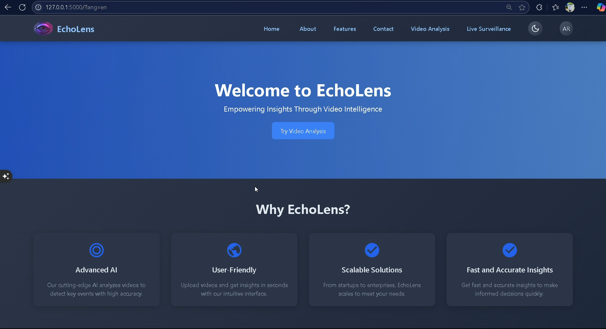
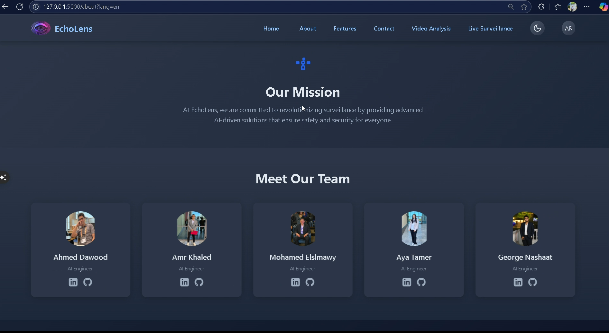
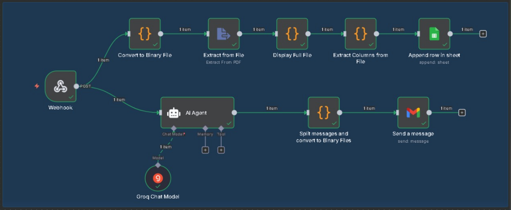

# 📹 ECHOLENS  
Smart AI-Powered Surveillance System – Real-time Event Detection & Reporting  

Team member : Ahmed Dawood - Amr Khaled 
---

## 🚀 Overview  
ECHOLENS is an AI-powered surveillance system that analyzes live streams or uploaded videos, detects critical events (e.g., theft, fights, accidents, vandalism), and generates descriptive reports in real time.  
It integrates with **n8n workflows** to send automated alerts via Gmail and log event metadata into Google Sheets.  

---

## 📂 Project Structure  

```bash
.
├── app.py                       # Main Flask application (entry point)
├── utils.py                     # Utility functions
├── grad.ipynb                   # Jupyter notebook (experiments / prototyping)
├── requirements.txt             # Project dependencies
├── static/                      # Static files (CSS, JS, images)
├── templates/                   # HTML templates for Flask
├── uploads/                     # Uploaded videos
├── outputs/                     # Processed outputs & reports
├── workflow(alert+storing).json # n8n workflow file
├── yolov12n.pt                  # Pre-trained YOLO model
└── README.md                    # Documentation

```

## ⚙️ Installation  

### 1️⃣ Clone the Repository  
```bash
git clone https://github.com/Ahmed-dawood10/Echolens.git
cd Echolens
```

### 2️⃣ Create Virtual Environment & Install Dependencies
# Option 1: Using venv (default)
python -m venv venv

source venv/bin/activate   # Linux/Mac

venv\Scripts\activate      # Windows

pip install -r requirements.txt

# Option 2: Using conda
conda create -n myenv python=3.9

conda activate myenv

pip install -r requirements.txt


### 3️⃣ Run Flask App
**By default, the app runs on:
👉 http://127.0.0.1:5000/**


## 🔄 Workflow Integration (n8n)  

1. Import the workflow file into your n8n instance:  
   - File: **`workflow(alert+storing).json`**  

2. Make sure the workflow is **Active** on your n8n server or local machine.  

3. Update the **Webhook URL** in `analysis.html and live.html` to match your n8n webhook endpoint:  
   ```python
   WEBHOOK_URL = "http://localhost:5678/webhook/echolens-alert"

Replace localhost with your server’s IP/domain if deployed.

The workflow will:

Send email alerts via Gmail for detected incidents.

Store event metadata in Google Sheets automatically.


## 🧪 Usage  

- **Upload Mode** → Upload a recorded surveillance video via the web dashboard.  
- **Live Mode** → Connect a real-time stream (e.g., RTSP feed from camera).  

The system will:  
1. Detect objects, track movements, and identify abnormal events.  
2. Generate descriptive incident reports.  
3. Trigger alerts and log data via the n8n workflow.


## 🎯 Future Enhancements  
- Edge deployment directly on cameras.  
- Cross-camera unified tracking with unique IDs.  
- Integration with enterprise VMS & smart city platforms.  


## 👤 Author  
Developed by **Echolens Team** 

📧 Contact: ahmeddawood0001@gmail.com 
             amrofficalwork2025@gmail.com


## 📸 Screenshots  
  
  

## 🔄 Workflow Diagram  
  


